# Online Retail II — Final Report

## 1. Overview

This project analyzes the [Online Retail II](https://archive.ics.uci.edu/dataset/502/online+retail+ii) dataset, a set of transactional records from a UK-based online retailer covering 2009–2011. The goal is to move from raw, messy transactional data to a clean analytical dataset and derive actionable insights around revenue, customer retention, and customer segmentation — the kind of end-to-end workflow a data/business analyst would run for a retail stakeholder.

## 2. Data Cleaning Summary

The raw export (541,910 line items, Dec 2010–Dec 2011) needed real cleanup before it could support any downstream analysis:

- **5,268 exact duplicate rows** (~1%) removed.
- **3 bad-debt adjustment invoices** ('A'-prefixed) removed.
- **1,336 internal stock write-offs** (negative-quantity, Price = 0, no Customer ID) removed — not real customer transactions.
- **1,174 rows with Price = 0 and positive Quantity** — a second, related issue the write-off filter above didn't catch. 1,134 of these have no Customer ID (same internal-adjustment pattern, dropped); the remaining 40 have a real Customer ID — genuine free/promotional items on real orders, kept but flagged `is_zero_value` so order/frequency counts downstream don't mistake them for a real purchase.
- **Cancelled orders** (`is_cancelled`, ~9,288 invoices) were flagged, not dropped, so downstream notebooks can compute Net Sales and return rate.
- The remaining ~25% of rows with no Customer ID aren't a data quality problem — they're guest checkouts, real revenue that just can't be attributed to a specific customer. This is why the pipeline exports two files: `revenue_df` (everything, for revenue-level KPIs) and `customer_df` (customer-attributed only, for anything requiring a Customer ID).
- A separate issue was documented but deliberately left unresolved: ~352 StockCodes (<0.1% of rows) map to multiple, inconsistent Descriptions. None of the affected rows have a Customer ID, so it doesn't touch `customer_df` or any customer-level analysis — deferred rather than fixed.

## 3. Revenue KPIs

| Metric | Value |
|---|---|
| Gross Sales | £10,631,066.74 |
| Returns | -£893,979.73 |
| Net Sales | £9,737,087.01 |
| Return Rate | 8.41% |
| AOV (Average Order Value) | £532.54 |
| Customer-Attributed Gross Sales | £8,887,226.89 |
| Customers | 4,338 |
| Repeat Customers | 2,845 |
| Repeat Purchase Rate | 65.58% |

Net Sales came to £9,737,087 after an 8.41% return rate ate into £10,631,067 of Gross Sales — a meaningful but not alarming share of transactions get cancelled.

At the customer level, 65.58% of identified customers are repeat buyers (2,845 of 4,338) — a healthy repeat-purchase rate on its face, though the cohort analysis in Section 5 shows this masks a steep month-over-month drop-off rather than steady reordering.

Guest/unattributed transactions matter: customer-attributed Gross Sales (£8,887,227) is only ~84% of total Gross Sales — roughly a sixth of revenue comes from orders with no Customer ID, real money that customer-level KPIs (repeat rate, cohort, RFM) structurally can't see.

**Caveat on the 8.41% return rate:** that single figure is an annual average that masks real monthly variation.

| Month | Orders | Return Rate |
|---|---|---|
| 2010-12 | 1,559 | 9.10% |
| 2011-01 | 1,086 | 19.04% |
| 2011-02 | 1,101 | 4.88% |
| 2011-03 | 1,454 | 4.78% |
| 2011-04 | 1,246 | 8.31% |
| 2011-05 | 1,681 | 6.14% |
| 2011-06 | 1,533 | 9.28% |
| 2011-07 | 1,475 | 5.28% |
| 2011-08 | 1,361 | 7.28% |
| 2011-09 | 1,838 | 3.68% |
| 2011-10 | 2,040 | 7.11% |
| 2011-11 | 2,770 | 3.17% |
| 2011-12 | 819 | 32.16% |

December 2011 only covers Dec 1–9 (819 orders vs. a normal ~1,000–2,770/month range) — it's excluded from any trend conclusion as a small-sample artifact, not a real spike. January 2011, a full month with 1,086 orders (in the normal range), had a return rate of 19.04% — more than double the next-highest non-December month (June 2011 at 9.28%) — a genuine outlier worth investigating (e.g. post-holiday returns).

## 4. Purchase Patterns

Order counts are heavily skewed: most customers place just 1 order, with the distribution dropping off sharply and a long tail of high-frequency buyers (up to 209 orders from a single customer) — the capped-at-10+ histogram below undersells how concentrated this really is.

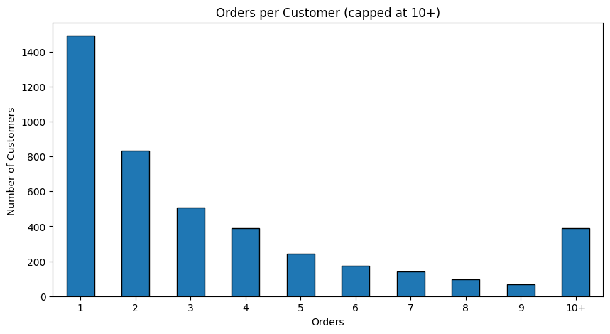

Repeat customers are worth far more per person than one-time buyers: **£2,908 average revenue for repeat customers vs. £411 for one-time buyers** — roughly a 7x gap. This confirms repeat buyers are the more valuable segment to retain, consistent with the RFM finding in Section 6 that a concentrated top tier drives most revenue.

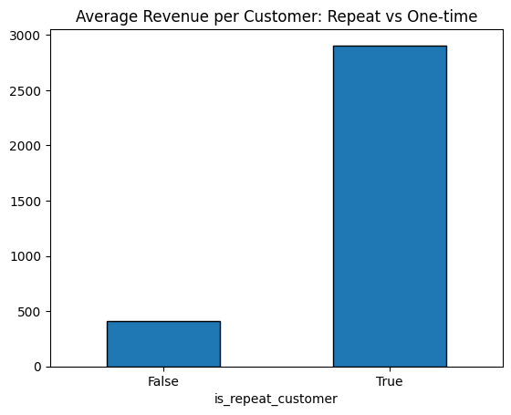

Revenue is also concentrated at the customer level, not just the repeat/one-time split: the **top 10 customers alone account for ~17% of total non-cancelled revenue** (led by Customer 14646 at £280,206 and Customer 18102 at £259,657).

The business is overwhelmingly UK-based — **88.8% of transaction rows are from the United Kingdom**, with Germany and France a distant second and third. Country-level spend/order/AOV comparisons should be read with that imbalance in mind; smaller countries' bars are based on far fewer data points and are less statistically stable.

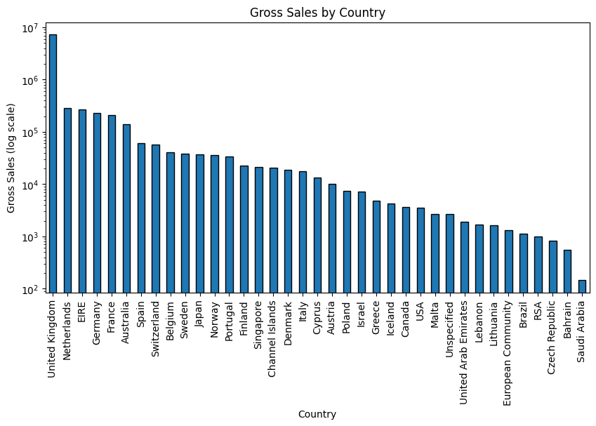

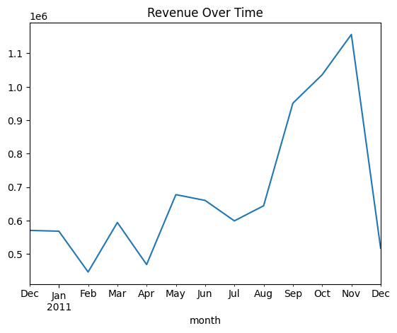

### Top Customers: Revenue vs. Order Volume Overlap

Only 3 of the top 10 customers by revenue also appear in the top 10 by order volume — Customers **14646, 14911, and 16029**. The other 7 in each list are distinct customers, suggesting high-value customers split into two different types: big-basket/infrequent buyers (high revenue per order, few orders) and frequent/moderate-basket buyers (many orders, lower revenue each). They likely need different retention approaches — white-glove/VIP treatment for the former, frequency or loyalty incentives for the latter — rather than one blanket "top customer" program.

### Orders Ramp Up Toward November

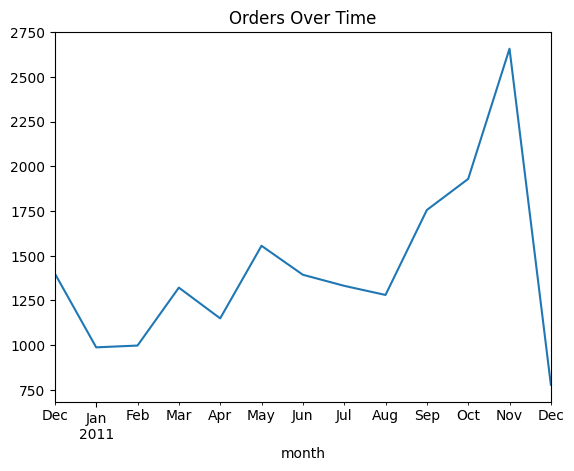

Customer-attributed order volume climbs steadily through the back half of the year — 1,755 in September, 1,929 in October, 2,657 in November (the year's peak) — consistent with demand building ahead of the holiday season. This points to a staffing/inventory planning implication: scale up through Q4, peaking around November. (Counting all invoices including guest checkouts, the same shape holds, running roughly 5–15% higher each month.)

The apparent drop to 778 orders in December 2011 (the last point on the chart above) is **not a real decline** — it's a partial-month artifact. The dataset only covers December 1–9, so that final point undercounts by roughly three weeks of data and should not be read as a post-November falloff.

### Repeat Rate vs. AOV by Country

After excluding countries with fewer than 20 customers as unreliable, only 6 of 37 countries qualify: United Kingdom, Germany, France, Spain, Belgium, and Switzerland.

| Country | Customers | Repeat Rate | AOV |
|---|---|---|---|
| Belgium | 24 | 75.0% | £420.37 |
| Switzerland | 20 | 75.0% | £1,106.74 |
| Germany | 94 | 72.3% | £500.39 |
| France | 87 | 67.8% | £537.15 |
| United Kingdom | 3,920 | 65.6% | £437.57 |
| Spain | 28 | 64.3% | £683.98 |

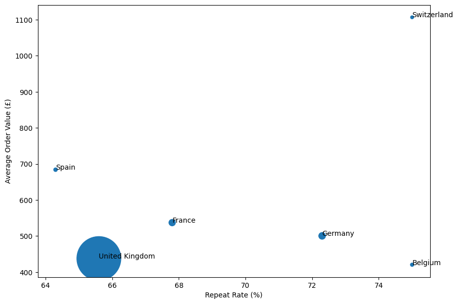

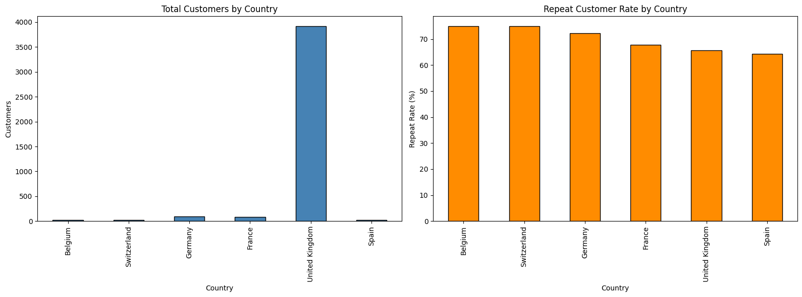

**What this answers:** the friction hypothesis doesn't hold. If friction (shipping cost, delivery time, no local payment option) were suppressing international demand, the expectation would be high AOV paired with a much lower repeat rate than the UK's 65.6% — customers spending well once, then not coming back because something about the experience discouraged them. That's not what's here. Every reliable international country has a repeat rate at or above the UK's, not below it — Switzerland is both the highest AOV (£1,106.74, more than double the UK's) and the highest repeat rate (75.0%) in this set. Germany and France also beat the UK's AOV and repeat rate simultaneously.

So the real answer is closer to a pure demand/reach problem, not friction. The customers who do buy internationally aren't struggling to come back — if anything they're more loyal and spend more per order than UK customers. International customers are ~9.7% of the customer base but generate ~18.0% of revenue — nearly double their proportional share. That gap isn't explained by a broken repeat experience; it's explained by there simply being far fewer international customers reaching the store in the first place (94 in Germany vs. 3,920 in the UK — a scale gap, not a satisfaction gap).

The business action that follows is different from what the friction hypothesis would have suggested: this doesn't point to "fix shipping/checkout friction," it points to "the demand that exists internationally converts well — the constraint is customer acquisition/reach, not retention." That's a marketing/reach lever, not an operations one.

## 5. Cohort Retention

Across all cohorts, retention drops sharply after the first month — customers fall from 100% (their acquisition month, by definition) to roughly 15–25% by month 1, meaning most one-time buyers don't return the following month. Past that initial cliff, though, retention doesn't keep decaying: it stabilizes in a fairly flat 20–40% band for most subsequent months, suggesting that customers who do come back once tend to keep coming back at a steady rate rather than churning further.

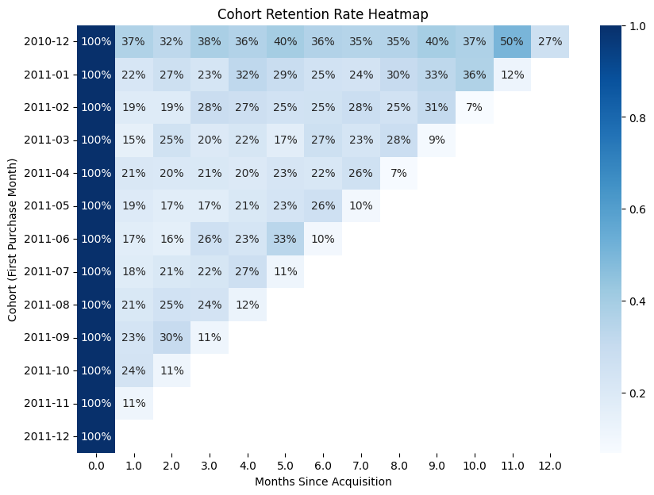

The December 2010 cohort — the largest (885 customers) and the only one with a full 12 months of observation — shows the highest and most stable late-period retention, including a 50% spike at month 11. This is likely a combination of it being the earliest cohort (customers had the most time to establish a repeat pattern) and possible seasonal effects (a December-acquired cohort re-engaging around the following holiday season).

Later cohorts (from roughly mid-2011 onward) show progressively fewer observed periods, and the December 2011 cohort has none at all beyond month 0 — not because those customers didn't return, but because the dataset ends in December 2011 and there's no later data to measure against.

Revenue per line item stays flat where retention doesn't. Unlike the retention grid, the median-revenue-by-cohort heatmap shows almost no variation — roughly £5–16.50 across every cohort and every period, mostly clustered around £10–15. In other words, *whether* a customer comes back varies a lot by cohort and time, but *how much they typically spend per item when they do* barely moves.

## 6. Customer Segmentation (RFM)

Customers were scored on Recency, Frequency, and Monetary value (terciles, 1–3 each, summed into an RFM score of 3–9) and collapsed into three tiers: Top (≥7), Middle (4–6), Low (≤3).

| Tier | Customers | % of Customers | Revenue | % of Revenue | Avg. Recency (days) | Avg. Frequency (orders) | Avg. Monetary |
|---|---|---|---|---|---|---|---|
| Top | 1,803 | 41.6% | £7,516,870.54 | 84.6% | 26.66 | 8.00 | £4,169.09 |
| Middle | 1,909 | 44.0% | £1,245,170.32 | 14.0% | 102.82 | 1.82 | £652.26 |
| Low | 626 | 14.4% | £125,186.03 | 1.4% | 244.00 | 1.00 | £199.98 |

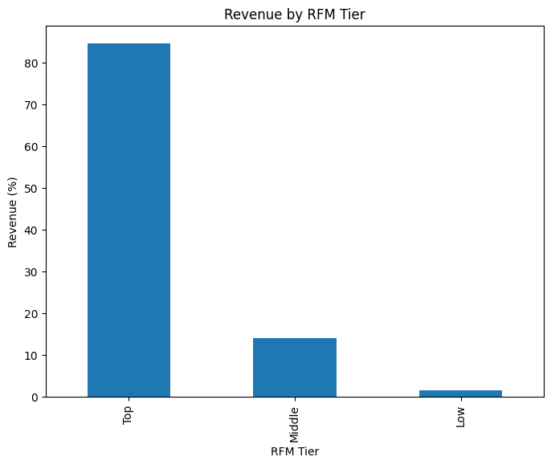

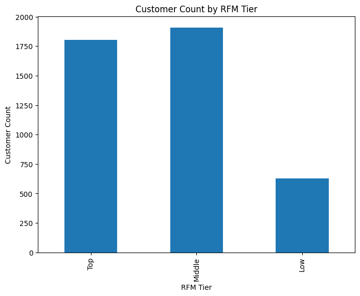

**Actionable Insights:**

1. **Top tier — early access, order-history-based perks.** 1,803 customers (~42%) generate ~85% of revenue, and they're already frequent (avg. 8 orders) and recent (avg. 27 days). This tier is concentrated, not diversified — losing even a small slice of it hurts more than any acquisition effort helps. Perks should reward existing behavior (early access to new stock, rewards tied to their own order history) rather than trying to convert them further.

2. **Middle tier — reminder emails timed to their historical purchase gap, post-purchase follow-ups, or a subscribe-and-save incentive.** ~1,910 customers, moderate spend (avg. £652), low frequency (avg. ~1.8 orders). Revenue per line item stays flat regardless of cohort (Section 5), so the lever here is purchase *frequency*, not basket size — nudges timed to when a customer is statistically due to reorder target the actual gap without discounting unnecessarily.

3. **Low tier — a time-limited second-order discount.** 626 customers, ~1 order each, contributing only 1.4% of revenue. This looks like "tried once and left," not "loyal but small" — and cohort retention (Section 5) shows most cohorts lose 75%+ of new customers by month 1. A discount aimed specifically at securing the *second* purchase targets that exact drop-off point.

## 7. Product Co-occurrence & Cancellations

The hypothesis under test: cancellations reflect customers sampling multiple colour/pattern variants of the same product and keeping only one, i.e. cancelling the rest.

For each cancelled invoice, a same-customer, non-cancelled invoice within ±7 days was searched for and classified into one of three buckets:

| Bucket | Count | % |
|---|---|---|
| No match | 1,928 | 52.8% |
| Same StockCode | 1,719 | 47.0% |
| Same product family | 7 | 0.2% |

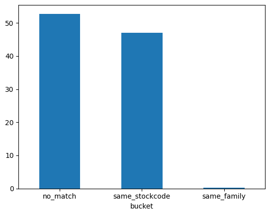

**This hypothesis was not supported by the data.** Same-family matches — a different StockCode from the same product family appearing in a nearby order, the pattern that would actually indicate variant-sampling — account for only 0.2% of cancelled invoices (7 of 3,654). This rules out product co-occurrence/variant-sampling as a meaningful driver of cancellations.

Two other patterns dominate instead:

1. **Same-StockCode reorders (47.0%)** — nearly half of cancellations involve the exact same product reappearing in a non-cancelled order within 7 days. This looks like a correction/reorder pattern (wrong item, damaged item, or a fulfillment issue prompting a redo) rather than browsing behavior.
2. **No related order at all (52.8%)** — the majority of cancellations have no nearby matching or related order, suggesting standalone dissatisfaction or unrelated cancellations not explained by either pattern tested here.

Business takeaway: there's no bundling opportunity to pursue here — customers are not routinely buying variant sets and keeping one, so a "pick your favorite from a pack" offer wouldn't be grounded in actual behavior. The more promising lead is the same-StockCode reorder pattern: if even a portion of that 47% reflects fulfillment errors rather than customer preference changes, that's a fixable operational cost, not a merchandising one.
